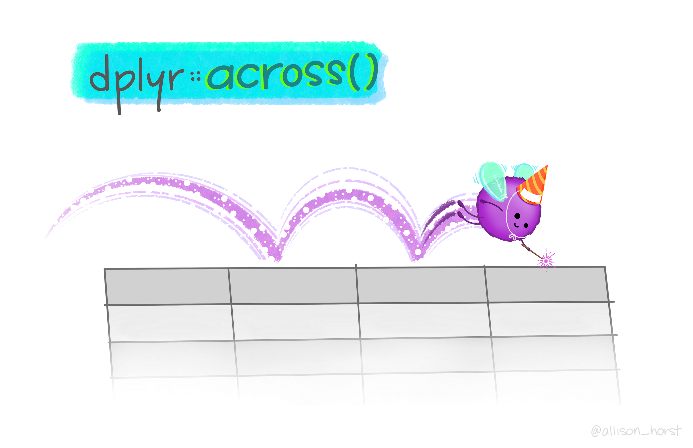
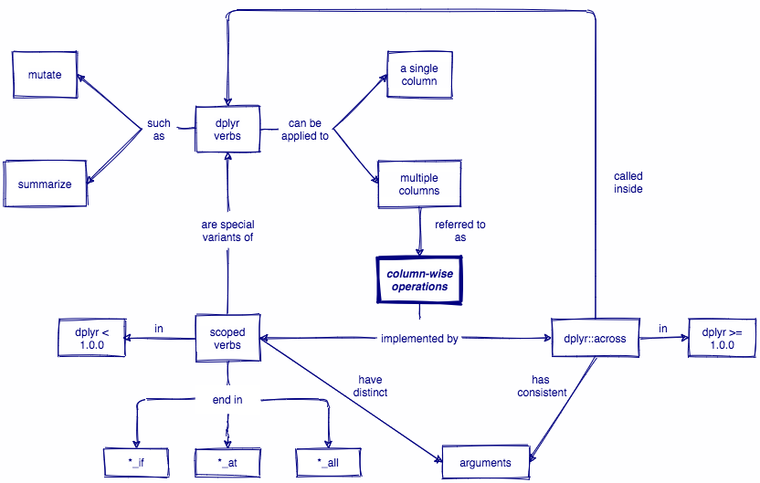

class: center, inverse

background-image: url(img/cover_image.png)
background-position: 50% 50%
background-size: 70%

# Using R more "wisely"
### Column-wise & row-wise operations with dplyr

<br><br><br><br><br><br><br><br><br>
## Brendan Cullen

### `r icon::fa("link")` [dplyr-wisely.netlify.app](https://dplyr-wisely.netlify.app)


```{r setup, echo=FALSE, warning=FALSE, message=FALSE}
options(htmltools.dir.version = FALSE)
library(countdown)
library(tidyverse)
library(xaringanExtra)
library(flair)
library(xaringanthemer)
library(metathis)


options(knitr.duplicate.label = "allow")

# xaringanExtra
use_xaringan_extra(include = c("panelset", "tile_view", "share_again"))
xaringanExtra::use_share_again()

style_share_again(share_buttons = c("twitter", "linkedin", "facebook"))

xaringanExtra::use_extra_styles(hover_code_line = TRUE, mute_unhighlighted_code = TRUE)

# theme
style_mono_accent(base_color = "#23395b",
                text_font_google = google_font("Montserrat", "300", "300i"),
                code_font_google = google_font("Source Code Pro"),
                link_color = "#BA8800",
                code_inline_color = "#BA8800")

# metathis
meta() %>%
  meta_general(
    description = "Working across multiple rows and columns with the latest updates from dplyr 1.0.0",
    generator = "xaringan and remark.js"
  ) %>% 
  meta_name("github-repo" = "brendanhcullen/wisely") %>% 
  meta_social(
    title = 'Using R more "wisely": Column-wise and row-wise operations with dplyr',
    url = "https://dplyr-wisely.netlify.app/",
    image = "https://dplyr-wisely.netlify.app/share-card.png",
    og_type = "website",
    og_author = "Brendan Cullen",
    twitter_card_type = "summary_large_image",
    twitter_creator = "@_bcullen"
  )
```

<link href='https://fonts.googleapis.com/css?family=Source+Sans+Pro' rel='stylesheet' type='text/css'>

```{css, echo=FALSE}
pre {
  max-width: 100%;
  overflow-x: scroll;
}

.inverse {
  background-color: #272822;
  color: #d6d6d6;
  text-shadow: 0 0 20px #333;
}
```

---
class: inverse, middle, center

# About me


## Brendan Cullen

#### NSF Graduate Research Fellow, University of Oregon <br> RStudio Certified Instructor

.fade[Portland, OR, USA]

[`r icon::fa("globe")`](https://bcullen.rbind.io/) [bcullen.rbind.io](https://bcullen.rbind.io/) | [`r icon::fa("twitter")`](https://twitter.com/_bcullen)  [_bcullen](https://twitter.com/_bcullen) | [`r icon::fa("github")`](https://github.com/brendanhcullen) [brendanhcullen](https://github.com/brendanhcullen)

---
class: inverse, middle, center

# About you

# `r icon::fa("user")`


#### `r emo::ji("check")` Familiar with the tidyverse


#### `r emo::ji("check")` Comfortable with common dplyr verbs, <br> e.g. `mutate()` and `summarize()`


#### `r emo::ji("check")` Want to more efficiently wrangle <br>and summarize data with dplyr

---
class: inverse, middle, center

# `r emo::ji("one")`
# Column-wise operations

---
# Learning objectives


- Review how to apply `dplyr` functions, e.g. `mutate()`, `summarize()`, to single columns

<br>

- Learn how to perform column-wise operations two ways: 

  - scoped verbs, e.g. `summarize_at()`, `summarize_if()`, etc...

  - `across()` from `dplyr` 1.0.0

<br>

- Apply `across()` to summarize multiple columns of data
---
background-image: url(img/dplyr_hex_old.png)
background-position: 90% 5%
background-size: 10%

# Column-wise operations

**Column-wise operations** refers to applying the same `dplyr` verbs (or other data transformation functions) to multiple columns simultaneously. 

--

e.g. Create multiple new columns with `mutate()`

```{r echo = FALSE, out.width = "40%"}
knitr::include_graphics("img/mutate.png")
```

--

e.g. Summarize multiple columns with `summarize()`

```{r echo = FALSE, out.width = "40%"}

```

---
background-image: url(img/penguins_hex.png)
background-position: 90% 5%
background-size: 10%

# Palmer Penguins

```{r warning=FALSE, message=FALSE}
library(palmerpenguins)
library(tidyverse)
```

```{r}
glimpse(penguins)
```

---
background-image: url(img/dplyr_hex_old.png)
background-position: 90% 5%
background-size: 10%

# Column-wise operations

***Let's review...***

Apply `summarize()` to a **single** column.

```{r echo = FALSE, out.width = "20%"}
knitr::include_graphics("img/summarize_single.png")
```

--

.panelset[

.panel[.panel-name[Example]
.pull-left[
`r emo::ji("thinking")` Use `summarize()` to calculate the mean **bill length** for each species in `penguins`

`r emo::ji("question")` What function do you need to include before `summarize()` in order to calculate means for each species?
]

.pull-right[
```{r echo = FALSE, out.width = "75%"}
knitr::include_graphics("img/penguins.png")
```

Artwork by @allison_horst

]
]


.panel[.panel-name[Code]

```{r summarize-one-col, eval=FALSE}
penguins %>% 
  group_by(species) %>% 
  summarize(bill_length_mm = mean(bill_length_mm, na.rm = TRUE))
```
]


.panel[.panel-name[Output]

```{r ref.label="summarize-one-col", echo=FALSE, message=FALSE}
```

]
]
---
name: multiple columns
background-image: url(img/dplyr_hex_old.png)
background-position: 90% 5%
background-size: 10%

# Column-wise operations

Apply `summarize()` to **multiple columns** at once

```{r echo = FALSE, out.width = "20%"}

```

--

.panelset[

.panel[.panel-name[Example #1]
.pull-left[
`r emo::ji("thinking")` Calculate the mean **bill length** and **bill depth** for each species

`r emo::ji("no_entry_sign")` Avoid copying and pasting or repeating `mean()` more than once in your solution
]

.pull-right[
```{r echo = FALSE, out.width = "100%"}
knitr::include_graphics("img/culmen_depth.png")
```
]

.pull-right[Artwork by @allison_horst]

]

.panel[.panel-name[Code]
```{r summarize-mult-1, eval=FALSE, echo = FALSE}
penguins %>% 
  group_by(species) %>% 
  summarize_at(vars(c(bill_length_mm, bill_depth_mm)), 
               mean, na.rm = TRUE)
```

```{r echo=FALSE, warning=FALSE}
decorate("summarize-mult-1", eval = FALSE) %>% 
  flair("summarize_at")
```

`r emo::ji("mag")` `summarize_at()` is an example of a **scoped verb**. It is a special variant of `summarize()` that applies a summary function to a specific set of columns.

`r emo::ji("exclamation_mark")` When using scoped verbs ending in `_at()` you must use `vars()` to select columns. 
]


.panel[.panel-name[Output]
```{r ref.label = "summarize-mult-1", echo=FALSE, message=FALSE}
```
]
]

---
template: multiple columns

.panelset[

.panel[.panel-name[Example #2]
`r emo::ji("thinking")` Calculate the mean of **all numeric** variables for each species.

`r emo::ji("no_entry_sign")` Again, no copying and pasting or repeating `mean()` more than once!
]

.panel[.panel-name[Code]
```{r summarize-mult-2, eval=FALSE, echo=FALSE}
penguins %>% 
  group_by(species) %>% 
  summarize_if(is.numeric, mean, na.rm = TRUE)
```

```{r echo=FALSE, warning=FALSE}
decorate("summarize-mult-2", eval = FALSE) %>% 
  flair("summarize_if")
```

`r emo::ji("mag")` `summarize_if()` is another example of a **scoped verb**. It is a special variant of `summarize()` that applies a summary function to a set of columns that all satisfy some logical criteria.

That logical criteria is specified using a **predicate function**, e.g. `is.numeric()`, which will return `TRUE` or `FALSE`.

]

.panel[.panel-name[Output]
```{r ref.label="summarize-mult-2", echo=FALSE, message=FALSE}
```
]
]
---
name: better way

# A better way?

.pull-left[
.center[
### dplyr < 1.0.0
```{r echo = FALSE, out.width = "50%"}
knitr::include_graphics("img/dplyr_hex_old.png")
```

`summarize_at()`, `summarize_if()`, `summarize_all()`, `mutate_if()`, `mutate_at()`, `mutate_all()`, ...
##`r emo::ji("sweat")`
]
]

--

.pull-right[
.center[
### dplyr >= 1.0.0
```{r echo = FALSE, out.width = "50%"}
knitr::include_graphics("img/dplyr_hex_new.png")
```

`across()`
<br><br><br>
##`r emo::ji("sunglasses")`
]
]

---
background-image: url(img/dplyr_hex_new.png)
background-position: 90% 5%
background-size: 10%

# `dplyr::across()`


.footnote[Artwork by @allison_horst]

---
background-image: url(img/dplyr_hex_new.png)
background-position: 90% 5%
background-size: 10%

# `dplyr::across()`


.footnote[Artwork by @allison_horst]

---
background-image: url(img/dplyr_hex_new.png)
background-position: 90% 5%
background-size: 10%

# `dplyr::across()`

```{r across-spec-color-coded, echo = FALSE, warning=FALSE}
decorate('across(.cols, .fns, ..., .names)', error = TRUE, eval=FALSE) %>% 
  flair(".cols", color = "cornflowerblue") %>% 
  flair(".fns", color = "red") %>% 
  flair("...", color = "orange") %>% 
  flair(".names", color = "darkorchid")
```

--

<span style="color: cornflowerblue; font-family:'Source Code Pro'"> .cols </span> = the columns you want to transform 

<br>
--

<span style="color: red; font-family:'Source Code Pro'">.fns </span> = the function(s) you want to apply to each of the selected columns

<br>
--

<span style="color: orange; font-family:'Source Code Pro'"> ... </span> = additional arguments for the function(s) specified in `.fns` (e.g. `na.rm = TRUE`)

<br>
--

<span style="color: darkorchid; font-family:'Source Code Pro'"> .names </span> = how you want to name the output columns. Here, `"{col}"` is a special placeholder for the input column name, and you can add any suffix you want to it 

--

- e.g. When calculating the mean of `penguins$year`, specifying <span style="color: darkorchid; font-family:'Source Code Pro'"> .names = "{col}_mean" </span> would result in an output column named "year_mean"

<br>
---
background-image: url(img/dplyr_hex_new.png)
background-position: 90% 5%
background-size: 10%

# `dplyr::across()`

```{r ref.label="across-spec-color-coded", echo = FALSE, warning=FALSE}
```

.panelset[

.panel[.panel-name[Example]
`r emo::ji("thinking")` Use `across()` to calculate the mean of **all numeric** columns for each species in `penguins`


`r emo::ji("megaphone")` Remember, `across()` goes *inside* of the `dplyr` function that you want to apply to multiple columns.
]

.panel[.panel-name[Code 1.0]
```{r across-example-v1, include = FALSE, message=FALSE}
penguins %>% 
  group_by(species) %>% 
  summarize(across(where(is.numeric), 
                   mean, 
                   na.rm = TRUE, 
                   .names = '{col}_mean'))
```

```{r echo=FALSE, message=FALSE, warning=FALSE}
decorate_chunk("across-example-v1", eval = FALSE) %>% 
  flair("across") %>% 
  flair("where(is.numeric)", color = "cornflowerblue") %>% 
  flair_rx(pattern = "mean(?=,)", color = "red") %>% 
  flair("na.rm = TRUE", color = "orange") %>% 
  flair(".names = '{col}_mean'", color = "darkorchid")
```

***

`r emo::ji("mag")` <span style="color: cornflowerblue; font-family:'Source Code Pro'"> where() </span> is an example of a tidyselect helper function, like `starts_with()` or `contains()`. 

It selects the variables for which some **predicate function**, such as <span style="color: cornflowerblue; font-family:'Source Code Pro'"> is.numeric() </span> returns `TRUE`. 
]

.panel[.panel-name[Output 1.0]
```{r ref.label="across-example-v1", echo=FALSE, message=FALSE}
```

`r emo::ji("eyes")` Notice that all of the output variables have the suffix "_mean".

]

.panel[.panel-name[Code 2.0]
```{r across-example-v2, include = FALSE, message=FALSE}
penguins %>% 
  group_by(species) %>% 
  summarize(across(where(is.numeric), 
                   list(mean = mean), 
                   na.rm = TRUE))
```

```{r echo=FALSE, message=FALSE, warning=FALSE}
decorate_chunk("across-example-v2", eval = FALSE) %>% 
  flair("where(is.numeric)", color = "cornflowerblue") %>% 
  flair("list(mean = mean)") %>% 
  flair("list(mean = mean)", color = "red") %>% 
  flair("na.rm = TRUE", color = "orange")
```

***

`r emo::ji("mag")` If you specify <span style="color: red; font-family:'Source Code Pro'"> .fns </span> as a named list, e.g. <span style="color: red; font-family:'Source Code Pro'"> list(mean = mean) </span>, then `across()` will automatically append the name of the applied function(s) to the names of the output columns.  

This way you don't have to manually specify a <span style="color: darkorchid; font-family:'Source Code Pro'"> .names </span> argument at all! 
]


.panel[.panel-name[Output 2.0]
```{r ref.label="across-example-v2", echo=FALSE, message=FALSE}
```

`r emo::ji("eyes")` Same exact output as before! 

]
]

---
background-image: url(img/dplyr_hex_new.png)
background-position: 90% 5%
background-size: 10%

# `dplyr::across()`

Multiple summaries with `across()` -- highly flexible!

```{r message=FALSE}
penguins %>%
  group_by(island) %>% 
  summarize(
    n = n(),
    across(where(is.factor), n_distinct),
    across(where(is.numeric), mean, na.rm = TRUE)
  )
```

---
background-image: url(img/dplyr_hex_new.png)
background-position: 90% 5%
background-size: 10%

# `dplyr::across()`

```{r echo=FALSE, out.width="80%"}

```

.footnote[Source: [rstudio/concept-maps](https://github.com/rstudio/concept-maps/#across), by [Emma Vestesson](https://emmavestesson.netlify.app/)]

---
background-image: url(img/dplyr_hex_new.png)
background-position: 90% 5%
background-size: 10%

# Recap

```{r echo=FALSE, out.width="85%"}

```

.footnote[Source: [rstudio/concept-maps](https://github.com/rstudio/concept-maps/#column-wise-operations)]

---
# More resources

### Further reading `r emo::ji("book")`

- [Blog post](https://www.tidyverse.org/blog/2020/04/dplyr-1-0-0-colwise/) by Hadley Wickham highlighting `across()` as a key component of the `dplyr` 1.0.0 update.

- [This vignette](https://dplyr.tidyverse.org/articles/colwise.html) on tidyverse.org about column-wise operations.

- Two blog posts by Rebecca Barter on [scoped verbs](http://www.rebeccabarter.com/blog/2019-01-23_scoped-verbs/) and [`across()`](http://www.rebeccabarter.com/blog/2020-07-09-across/).

### Practice `r emo::ji("computer")`

- Small [collection of exercises](https://brendancullen.shinyapps.io/columnwise_operations_formative_assessment/) I put together to accompany these slides

- [Interactive tutorial](https://github.com/laderast/tidyowl#learning_tidyselect) by Ted Laderas on `tidyselect` and a [full list](https://dplyr.tidyverse.org/reference/select.html) of selection helpers.

---
class: inverse, middle, center

```{r echo=FALSE}
countdown::countdown(minutes = 5)
```


# Q & A
---
class: inverse, middle, center

# `r emo::ji("two")`
# Row-wise operations

---
# Learning objectives 

- Learn and apply `rowwise()` to produce row-by-row summaries

<br> 

- Use `nest_by()` to create list-columns

<br>

- Run multiple statistical models on a list-column using `rowwise()`

---
background-image: url(img/dplyr_hex_new.png)
background-position: 90% 5%
background-size: 10%

# Row-wise operations 

`rowwise()` lets you run operations one row at a time on the data. It’s a lot like `group_by()`, but it groups the data by row, rather than group. 

--
***

What happens when you use `rowwise()` to create a rowwise data frame? `r emo::ji("eyes")`

```{r}
penguins %>% 
  rowwise()
```

---
background-image: url(img/dplyr_hex_new.png)
background-position: 90% 5%
background-size: 10%

# Row-wise operations 

Let's say we want to compute the mean of `bill_length_mm` and `bill_depth_mm` for each penguin.

--
***

`r emo::ji("exclamation_mark")` Using `mutate()` and `mean()` won't give us what we want.

.panelset[

.panel[.panel-name[Code]

```{r avg-whole, eval=FALSE}
penguins %>%
  mutate(avg_bill = mean(c(bill_length_mm, bill_depth_mm), na.rm = TRUE)) %>%
  select(species, island, avg_bill)
```
]

.panel[.panel-name[Output]
```{r ref.label="avg-whole", echo=FALSE}
```

]
]
---
background-image: url(img/dplyr_hex_new.png)
background-position: 90% 5%
background-size: 10%

# Row-wise operations 

If we first use `rowwise()` to create a rowwise data frame, then this calculation will be carried out row-by-row (i.e. for each penguin)

.panelset[

.panel[.panel-name[Code]

```{r rowwise-means, eval=FALSE}
penguins %>%
  rowwise() %>%
  mutate(avg_bill = mean(c(bill_length_mm, bill_depth_mm), na.rm = TRUE)) %>%
  select(species, island, avg_bill)
```
]

.panel[.panel-name[Output]
```{r ref.label="rowwise-means", echo=FALSE}
```

]
]

---
background-image: url(img/dplyr_hex_new.png)
background-position: 90% 5%
background-size: 10%

# Row-wise operations

`c_across()` uses tidy selection syntax so you can to succinctly select many variables at once

.panelset[

.panel[.panel-name[Code]

```{r c_across, eval=FALSE}
penguins %>%
  rowwise() %>%
  mutate(avg_bill = mean(c_across(contains("bill")), na.rm = TRUE)) %>%
  select(species, island, avg_bill)
```

]

.panel[.panel-name[Output]
```{r ref.label="c_across", echo=FALSE}
```

]
]

---
background-image: url(img/dplyr_hex_new.png)
background-position: 90% 5%
background-size: 10%

# List columns

Data frames are not limited to atomic vectors. They can also contain recursive vectors, i.e. **lists**.

A list column can be a list of data frames. 

--
***

You can create a list column containing data frames using `nest_by()`.

--

.pull-left[
```{r}
nested_penguins <- penguins %>% 
  nest_by(species)

nested_penguins
```
]

.pull-right[
#### Notice the following `r emo::ji("eyes")`

- Similar to `group_by()` but it visually changes the structure of the data

- Returns a rowwise data frame

- Default output column name is `data` (can override with `.key` argument)
]

---
background-image: url(img/dplyr_hex_new.png)
background-position: 90% 5%
background-size: 10%

# List columns

How would you extract the data frame containing the data for Chinstrap penguins out of `nested_penguins`?

--

Notice it does not contain the `species` variable `r emo::ji("eyes")`

```{r}
nested_penguins$data[[2]]
```

---
background-image: url(img/dplyr_hex_new.png)
background-position: 90% 5%
background-size: 10%

# Many models

You can use a rowwise workflow to run a separate model on each data set in a list column.

--

```{r penguins_models}
penguins_models <- nested_penguins %>%
  mutate(model = list(lm(bill_length_mm ~ flipper_length_mm, data = data)))

penguins_models
```

---
background-image: url(img/dplyr_hex_new.png)
background-position: 90% 5%
background-size: 10%

# Many models 

However, if we access the model column, you’ll notice that it just prints the output of each fit. 

```{r}
penguins_models$model[[1]]
```

--

That output is not super helpful. How can we get more useful information?

---
background-image: url(img/dplyr_hex_new.png)
background-position: 90% 5%
background-size: 10%

# Many models 

We can use functions from the **broom** package to extract summary information about each model in a tidy data frame. 

--

.panelset[

.panel[.panel-name[`broom::tidy()`]

`broom::tidy()` returns a row for each coefficient in the model. Each column gives information about the estimate or its variability.

```{r broom-tidy, message=FALSE, eval=FALSE}
nested_penguins %>%
  mutate(model = list(lm(bill_length_mm ~ flipper_length_mm, data = data))) %>%
  summarize(broom::tidy(model))
```

]

.panel[.panel-name[Output]

```{r ref.label="broom-tidy", echo=FALSE, message=FALSE}
```
]

.panel[.panel-name[`broom:glance()`]

`broom::glance()` returns a row for each model. Each column gives a model summary: either a measure of model quality, or complexity, or a combination of the two.

```{r broom-glance, eval=FALSE}
nested_penguins %>%
  mutate(model = list(lm(bill_length_mm ~ flipper_length_mm, data = data))) %>%
  summarize(broom::glance(model))
```

]

.panel[.panel-name[Output]

```{r ref.label="broom-glance", echo=FALSE, message=FALSE}

```
]
]

---
# More resources

### Further reading `r emo::ji("book")`

- [Blog post](https://www.tidyverse.org/blog/2020/04/dplyr-1-0-0-rowwise/) by Hadley Wickham demonstrating helpful use cases for `rowwise()`, e.g. simulations and modeling

- [This vignette](https://dplyr.tidyverse.org/articles/rowwise.html) on tidyverse.org about row-wise operations.

- [Chapter 25](https://r4ds.had.co.nz/many-models.html) from r4ds on "Many models"

### Practice `r emo::ji("computer")`

- [Interactive tutorial](https://github.com/laderast/tidyowl#learning_rowwise-in-development) by Ted Laderas on learning `rowwise()`

---
# Acknowledgements 

Much of this material was based on blog posts written by [Hadley Wickham](http://hadley.nz/) and [Rebecca Barter](http://www.rebeccabarter.com/) along with tutorials developed by [Ted Laderas](https://laderast.github.io/), which you can access through his [tidyowl](https://github.com/laderast/tidyowl) package

---
class: inverse, center, middle

# Thank you! 
# `r emo::ji("slightly_smiling_face")`

### Materials at <br> `r icon::fa("github")` [github.com/brendanhcullen/wisely](https://github.com/brendanhcullen/wisely)